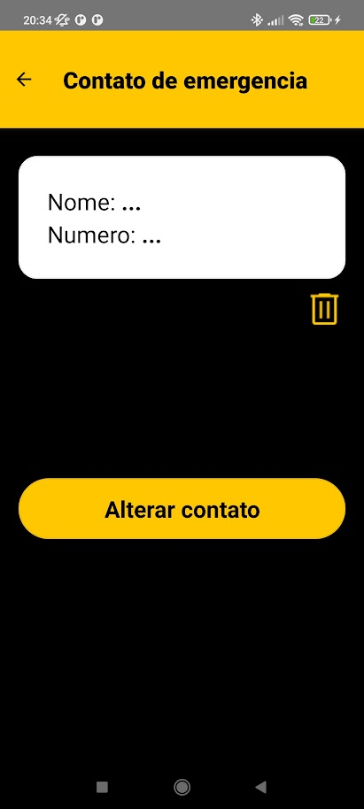

# SOBRE
O aplicativo **AjudePlus** foi desenvolvido para disciplina de desenvolvimento de sistemas orientado a dispositivos móveis e baseados na web do quarto periodo de analise e desenvolvimento de sistemas do SENAC.

Ele visa desenvolver aumentar a acessibilidade dos serviços de emergencia para o idosos, pessoas com doenças crônicas, físicas ou cognitivas.

O aplicativo foi desenvolvido usando React Native para plataformas **Android**.

# INTEGRANTES

**Grupo 4**

- Nathan de Sousa Pires
- Sergio Gabriel Junior
- Larissa Martins de Souza
- Marina Silva de Oliveira
- Sidney Vieira da Silva Junior
- Tauanny Virginio Furlanetto da Silva

# COMO RODAR

Voce vai precisar ter o `npm` e o `Android Studio` instalados, siga o tutorial oficial do [ReactNative](https://reactnative.dev/docs/environment-setup) pra fazer a configuracao completa.

1. Instale todas as dependencias
```
npm install
```

2. Configure o ambiente Android. No Windows, defina as variaveis:
```
ANDROID_HOME=C:\Users\<usuario>\AppData\Local\Android\Sdk
ANDROID_SDK_ROOT=C:\Users\<usuario>\AppData\Local\Android\Sdk
```

A partir dai voce pode ou iniciar o app com o `Expo`  ou fazendo um build manual.

**manual**

1. [Crie](https://developer.android.com/studio/run/managing-avds) e inicie o dispositivo virtual no Android Studio


2. Adicione um contato com nome e telefone no aparelho;

3. Numa aba do terminal, inicie o servidor
```
npx react-native start
```
4. Em outra aba, faca um build na aplicacao
```
npx react-native run-android
```

**expo**

> **NAO UTILIZAR O EXPO**
> ao usar o expo o aplicativo fica inutilizavel, pois:
> - o expo nao consegue nem pedir permissoes nem acessar os aplicativos nativos (telefone, sms etc) do celular
> - o aplicativo fica com as cores quebradas no modo noturno em certas versoes do sistema operacional (notavelmente Xiaomi e POCO)

Porem, caso voce somente consiga rodar o aplicativo usando o expo, siga os passos a baixo:

1. Execute o comando `npx expo start` no terminal.
2. Ou:
    - Inicie o emulador no AndroidStudio e espere o projeto iniciar e digite `a` para iniciar o app no emulador.
    - Instale o app `Expo Go` no seu celular e escanei o QRCode no terminal do expo
3. No emulador, clique em `expo go`.

Caso voce nao consiga se conectar pelo app, desligue temporariamente o firewall privado no seu computador e tente de novo.

# COMO TESTAR
Considerando as limitacoes do Expo, e necessario emular o aplicativo rodando manualmente como especificado na secao **Como rodar Android**.

Algumas observacoes importantes:

- O aplicativo trabalha com tres permissoes (SMS, Contatos e Telefone);
- Se as permissoes forem negadas em *runtime* voce vai precisar permiti-las manualmente pelas configuracoes do aparelho, porque o aplicativo define-as como `never_ask_again`, nao sendo possivel pedir as permissoes novamente pelo aplicativo;
- E importante destacar que o comportamente do app e diferente se as permissoes forem negadas pelas configuracoes, porque, nesse caso, podemos pedi-las novamente;
- Como o aplicativo liga automaticamente ao clicar no botao de chamadas, os numeros de emergencia foram substituidos por `111`, voce pode alterar esse comportamento trocando a variavel `DEVELOPMENT_CALLS` para `false` no arquivo `app/js/config.js`;
    - Recomenda-se **nao** contatar os numeros de emergencia (SAMU, BOMBEIROS e POLICIA) caso essa variavel seja desabilitada.
    - Como o aplicativo manda SMS e provavel que voce ira pagar pelas mensagens
- Como o aplicativo guarda estado, caso queira limpar os dados armazenados, defina `CLEAR_DATABASE` para `true` em `app/js/config.js`. Isso vai fazer que a a cada build o banco de dados seja limpo.

Assim, vamos inicialmente testar o aplicativo concendendo todas as permissoes e manualmente remove-las, ate que todas sejam negadas (pelas configuracoes) e eventualmente em *runtime*.

1. Abra o aplicativo;
2. Conceda acesso ao Telefone;
3. Clique em **Adicionar contato de emergencia**;
4. Conceda permissao aos Contatos;
5. Selecione um contato;
6. De permissao para mandar SMS;
7. O aplicativo deve abrir a Tela Principal;

A Tela Principal deve ter essa aparencia, com o seu contato selecionado no topo da tela:


1. Feche e abra o aplicativo, ele deve ir diretamente para a Tela Principal.
2. Clique no botao de Configuracao de Contato (o com a engrenagem na base da tela).
3.  Remova o Contato selecionado.
4.  Observe se o card branco esta com essa aparencia.


1.  Clique em voltar, voce deve retornar a Tela Principal.
2.  Verifique o se o botao de ligar pro contato pessoal foi substituido pelo botao de Adicionar.
3.  Clique no botao de Configuracao de Contato.
4.  Selecione Atualizar Contato.
5.  Adicione um contato.
6.  Verifique se os dados do contato estao aparencendo no card branco.
7.  Volte a tela inicial.
8.  Verifique se o nome do contato esta aparecendo no botao superior.


1.  Clique no botao de Configuracao de Contato.
2.  Remova o contato.
3.  Volte a Tela Principal, verifique se o botao de chamar o contato pessoal foi substituido pelo botao de "Adicionar"


1.  Adicione um contato pelo botao no topo da tela.
2.  Verifique se os dados do contato estao sendo Exibidos no Card Branco e na Tela Principal.
3.  Volte na tela de Configuracao de Contato e clique em Alterar Contato, troque o contato e verifique se ele esta sendo exibido nas duas telas.
4.  Clique para ligar ao Contato Pessoal -- se desejado crie um contato separado com um numero quebrado (ex: `111`) pra evitar pagar pelas mensagens.
5.  Verifique se o discador abre **ja executando a ligacao**.
6.  Ao fechar o discador, voce deve voltar para tela de Ligacao de Emergencia


1.  Ao fechar a tela de ligacao de emergencia voce deve voltar para a Tela Principal.
2.  Abra seu aplicativo de mensagens, um SMS para o numero do contato pessoal deve ter sido
mandado.

### ADICIONANDO O CONTATO DEPOIS
Para cada passo a baixo siga essas instrucoes: defina a variavel `CLEAR_DATABASE` em `app/js/config.js` como `true`, recarregue o app e depois defina como `false`. Negue todas a permissoes no aparelho.
1. Abra o aplicativo;
2. Conceda acesso ao Telefone;
3. Clique em **Adicionar depois**;
4. Voce deve ser redirecionado a Tela Principal;
5. O botao "Adicionar" deve ser exibido no topo da tela.

### NEGANDO AS PERMISSOES PELAS CONFIGURACOES
1. Nas configuracoes do aparelho, negue a permissao para mandar SMS.
2. As funcionalidades de ligacao e adicionar contatos devem estar funcionando normalmente,
ao ligar, SMSs nao devem estar sendo mandados. Ao atualizar um contato o alerta "Proibido de mandar SMS" deve ser exibido novamente.
3. Volte nas configuracoes e permita manualmente o acesso aos SMS, faca uma chamada. O aplicativo deve voltar mandar mensagens.
4. Nas configuracoes do aparelho, negue a permissao para acessar os contatos.
5. Va nas Configuracoes de Contato e tente atualizar o contato.
6. O aplicativo deve pedir permissao, negue. O aplicativo deve emitir o alerta de "Proibido de acessar os Contatos". Clique em Ok.
7. Tente atualizar o contato novamente, o aplicativo deve o mesmo alerta.
8. Caso voce manualmente permita os contatos nas configuracoes do aparelho, voce deve conseguir inserir um contato no aplicativo.
9. Nas configuracoes do aparelho, negue a permissao para acessar o telefone.
10. Abra o aplicativo novamente, ele deve exibir a Tela Principal e deve pedir a permissao de acesso ao telefone, negue. O alerta de "Proibido de acessar o telefone" deve ser exibido, clique em Sair.
11. Abra o aplicativo de novo, o mesmo alerta deve ser exibido.
12. Permita acesso ao Telefone nas configuracoes, abra o aplicativo e ele deve funcionar normalmente.

### NEGANDO AS PERMISSOES EM RUNTIME
Para cada passo a baixo siga essas instrucoes: defina a variavel `CLEAR_DATABASE` em `app/js/config.js` como `true`, recarregue o app e depois defina como `false`. Negue todas as permissoes nas configuracoes do aparelho. Abra o app de novo.

1. Siga os passos 1-5, e **negue** o acesso as mensagens. Faca uma ligacao, o aplicativo nao deve mandar SMS, ele tambem deve emitir um alerta a cada vez que o contato e atualizado. Permitir acesso as mensagens deve reverter esse comportamento.
2. Siga os passos 1-3, e **negue** o acesso aos contatos. O aplicativo deve emitir um alerta todas as vezes que o o botao "Atualizar contato" e clicado. Permitir o acesso aos contatos deve reverter esse comportamento.
3. Abra o aplicativo, e **negue** o acesso aos contatos, o alerta de "Proibido de acessar o telefone" deve ser exibido, clique em Sair. Abra o app novamente, o mesmo alerta deve ser exibido, a tela de boas vindas deve ser o fundo. Permita o acesso pelas configuracoes e abra o aplicativo, o alerta nao deve aparecer e voce deve ser capaz de adicionar um contato.

TODO: ao clicar na tela de configurar contato na pagina de emergencia nos devemos voltar para a home
-----

# SOLUCAO DE PROBLEMAS

**Nao consigo configurar meu ambiente Android**
 Dentro da pasta Android crie o arquivo `local.properties` e cole o trecho a baixo (para Windows):
 ``` 
sdk.dir=C\:\\Users\\<usuario>\\AppData\\Local\\Android\\Sdk
 ``` 